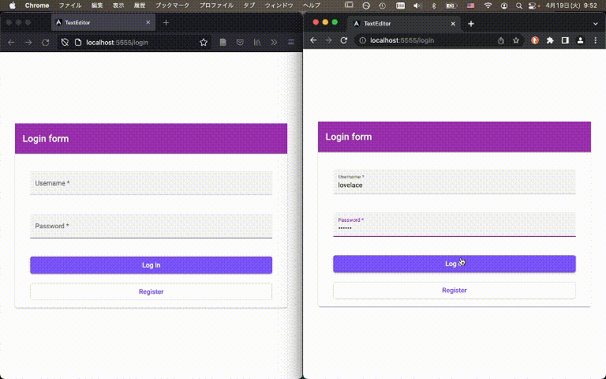
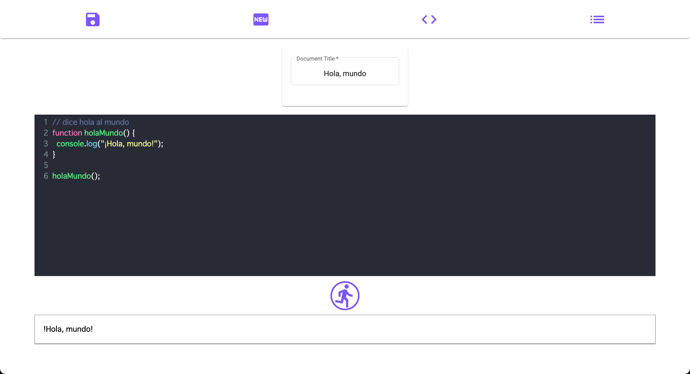

# TextEditor: Angular

This is an [Angular](https://angular.io) project which uses the [Quill Editor](https://quilljs.com/). It's put together for a [JavaScript framework course](https://jsramverk.se) at Blekinge Institute of Technology.

The app has a Quill editor which you can use as a regular text editor, and some buttons. The 'save' button sends new/updated documents to the backend/database. The 'list' button brings up selectable previously saved documents. The 'new' button clears title and text input fields. Using socket.io, all document body text updates are broadcast to all other clients using the text editor and working on the same document. The editor also includes a 'code mode', which allows writing pieces of code and having a separate service run them to see what output they produce.

## Deployment
`cd` to this directory and run `ng build` to build the project. 

Once you've run `ng build`, you can either serve the files in `dist/text-editor`, or you can build a Docker image using this directory's Dockerfile by running eg `sudo docker build -t text-editor-angular .`. This image can then be used to generate Docker containers which use [nginx](https://nginx.org/) to serve the application on (container) port 80. To make the app available on the host computer ('localhost'), on say port 5555 you can run something like `docker run -p 5555:80 -d --name texted-angular text-editor-angular`. 

__Note__ that if you want to use a reverse proxy with the Docker container, and in many other situations, you might need to add the `--deploy-url` (for changing generated asset URL's) and/or `--base-href` (for changing routing URL's) flags to the `ng build` command. For more information, please see the official [Angular docs on deployment](https://angular.io/guide/deployment#the-deploy-url).

## Development server
Run `ng serve` for a dev server. Navigate to `http://localhost:4200/`. The app will automatically reload if you change any of the source files.

## Running unit tests
Run `ng test` to execute the unit tests via [Karma](https://karma-runner.github.io).
